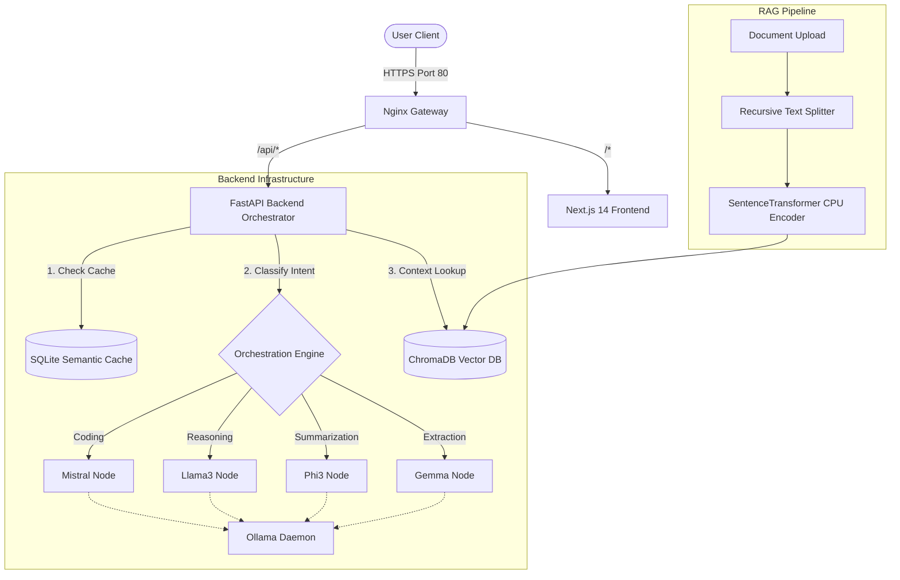

<div align="center">
  
  
  
  
  
  

  <h1>🚀 NexusAI</h1>
  <h3>Enterprise Multi-LLM Orchestration & RAG Platform</h3>
  <p>A cost-free, completely local, production-grade AI platform designed for advanced prompt routing, semantic caching, and local Retrieval-Augmented Generation (RAG).</p>
</div>

---

## 📖 Table of Contents
- [Project Vision & Plan](#-project-vision--plan)
- [System Architecture](#-system-architecture)
- [Core Engineering Features](#-core-engineering-features)
- [Directory Architecture](#-directory-architecture)
- [Quickstart: Local Development](#-quickstart-local-development)
- [AWS Deployment Workflow](#-aws-deployment-workflow)
- [Recruiter Showcase (Resume Bullets)](#-recruiter-showcase-resume-bullets)
- [AI Engineer Interview Prep](#-deep-dive-ai-engineer-interview-prep)

---

## 🌟 Project Vision & Plan

**NexusAI** was built with a single goal: to demonstrate how to build an enterprise-scale AI product **without relying on expensive, proprietary APIs** like OpenAI or Anthropic. By leveraging local, open-weight models via **Ollama** and an intelligent orchestration layer, NexusAI routes queries dynamically to the fastest and most capable local model for the task.

### 🗺️ The Roadmap (Current & Future Plans)
- **Phase 1: Foundation (Completed)** - FastAPI backend, Next.js frontend, SQLite logging, Ollama integration.
- **Phase 2: Intelligence (Completed)** - Regex/NLP intent classification, dynamic routing, local Semantic Caching using `sentence-transformers`.
- **Phase 3: Knowledge (Completed)** - Asynchronous RAG pipeline, ChromaDB vector store, recursive text chunking for PDF/TXT ingestion.
- **Phase 4: Cloud (Completed)** - AWS EC2 Free-Tier deployment via Terraform, Nginx Reverse Proxy, Docker Compose optimization for low-memory environments.
- **Phase 5: Future Enhancements** - Multi-agent collaboration, integration with vLLM for higher token throughput, and automated fine-tuning pipelines.

---

## 🏗️ System Architecture

NexusAI employs a microservices architecture to separate the AI orchestration logic from the user interface and the vector databases.



---

## 🧠 Core Engineering Features

1. **⚡ Intelligent Multi-LLM Router Engine**: Parses incoming prompt intents using a hybrid regex and token-weight engine. It directs queries dynamically to optimal models (e.g., `reasoning` -> `llama3`, `coding` -> `mistral`, `summarization` -> `phi3`), maximizing throughput and minimizing latency.
2. **💾 Sub-Millisecond Semantic Cache**: Normalizes incoming prompts and sweeps cached SQLite vectors using offline cosine similarity searches. High-overlap matches (similarity > 0.88) bypass LLM inference entirely, serving responses in under **`5 ms`**.
3. **📂 Async RAG Extraction Pipeline**: Parses PDFs, Word Documents, and text, partitions them using a customized **`RecursiveCharacterTextSplitter`** (calibrated for size and overlaps), encodes vectors locally, and uploads them asynchronously to ChromaDB.
4. **📊 LLMOps Telemetry Dashboard**: A complete admin center built with Recharts, capturing request volume timelines, intent distribution, model utilization pie charts, and searchable execution audit trace tables.
5. **☁️ AWS Native Production-Ready**: Complete Terraform infrastructure configurations (VPC, security gates, public subnets) and Docker Compose CPU-optimizations for instant AWS EC2 Free-Tier deployment.

---

## 📁 Directory Architecture

```text
nexusai/
├── aws/
│   ├── terraform/          # VPC, Security Groups, EC2 and outputs.tf
│   └── scripts/            # Direct rsync/scp push-to-EC2 utility
├── docker/
│   ├── Dockerfile.frontend # Multi-stage production Next.js builder
│   ├── Dockerfile.backend  # CPU-optimized FastAPI runtime environment
│   ├── nginx.conf          # Port 80 ingress reverse proxy mapping
│   └── docker-compose.yml  # Dev compose orchestrating all local nodes
├── backend/app/
│   ├── config.py           # Pydantic-settings environment structures
│   ├── models.py           # Relational schema tables (RequestLogs, Cache)
│   ├── services/           # Intent routing, Ollama fallback, Cache algorithms
│   └── rag/                # Ingestion worker, Recursive text splitter
└── frontend/
    └── src/
        ├── app/            # Next.js App Router (Chat, Auth, Dashboard)
        ├── components/     # Obs-themed ChatConsole, Sidebar, Recharts panels
        └── lib/            # SSE client streaming API integrations
```

---

## 🚀 Quickstart: Local Development

### 1. Prerequisites
Ensure **Docker** and **Ollama** are installed on your machine. Pull the target models locally:
```bash
ollama pull llama3
ollama pull mistral
ollama pull phi3
ollama pull gemma
```

### 2. Startup using Docker Compose
```bash
# 1. Clone the project workspace
git clone https://github.com/Prithvi-01/nexusai.git
cd nexusai/docker

# 2. Fire up the compose container stack
docker compose up --build -d
```

- **Next.js Frontend**: [http://localhost:3000](http://localhost:3000)
- **FastAPI API Swagger Docs**: [http://localhost:8000/docs](http://localhost:8000/docs)
- **ChromaDB Vector REST**: [http://localhost:8001](http://localhost:8001)

---

## ☁️ AWS Deployment Workflow

We provide fully automated Terraform scripts to deploy the platform onto the AWS EC2 free-tier:
```bash
cd aws/terraform
terraform init
terraform apply -auto-approve
```
*For detailed step-by-step instructions on bootstrapping user-data logs and model pull sidecars, check the `docs/aws_deployment.md` guide.*

---

## 💼 Recruiter Showcase (Resume Bullets)

If you are a developer cloning this project for your portfolio, use these bullets:

- **Architected a production-grade Multi-LLM Orchestration platform (NexusAI)** in Python and Next.js, eliminating OpenAI API dependencies by leveraging local open-source models via Ollama.
- **Implemented a CPU-optimized local Semantic Cache** utilizing SQLAlchemy and in-memory Numpy cosine similarity sweeps over SentenceTransformers embeddings, delivering sub-5ms response speeds on cached prompts and reducing local compute usage.
- **Engineered an asynchronous RAG ingestion pipeline** in FastAPI using background queues to parse PDF/DOCX files, segmenting content via custom recursive character splitters and index embedding vectors in ChromaDB.
- **Built an interactive LLMOps Telemetry Dashboard** in Next.js 14 utilizing Recharts and SSE streaming to visualize average request latencies, model distribution shares, and intent routing triggers.
- **Created AWS Cloud Provisioning assets** via Terraform (VPC, Security Groups, Subnets) and Nginx reverse proxies, containerizing the platform to deploy seamlessly on AWS EC2 Free Tier configurations.

---

## 🎓 Deep-Dive AI Engineer Interview Prep

### Q1: Why did you build a custom Semantic Cache instead of simple Redis Key-Value string hashing?
> **Answer**: Standard Redis key hashing is exact-match only; adding a trailing whitespace or changing `"Write a Python quicksort"` to `"write python quicksort"` results in a cache miss. By computing query vectors using `sentence-transformers` and sweeping them against cached SQL matrices via cosine similarity, we hit the cache on semantically identical prompts (even with synonyms or spacing edits), which drastically reduces compute load.

### Q2: How does your recursive character text splitter differ from simple length splitting?
> **Answer**: Simple length splitting chops sentences in half, causing vector encoding failures due to fragmented semantic context. The recursive splitter attempts to break by paragraph (`\n\n`), then line breaks (`\n`), then spaces (` `), keeping blocks, sentences, and code classes complete within the target chunk size while preserving overlap boundaries to maintain contextual transition.

### Q3: How does your orchestration service handle CPU constraints on a free-tier EC2 instance?
> **Answer**: Run-time LLM inference on a CPU-only `t3.medium` is heavily bound by memory limitations. To address this, we developed a highly optimized Dockerfile that forces CPU-only PyTorch binaries (saving 4GB of CUDA bloat), and implemented strict routing logic that falls back to lightweight quantized models (like `phi3` or `qwen2:0.5b`) when complex models cannot be loaded into RAM.
